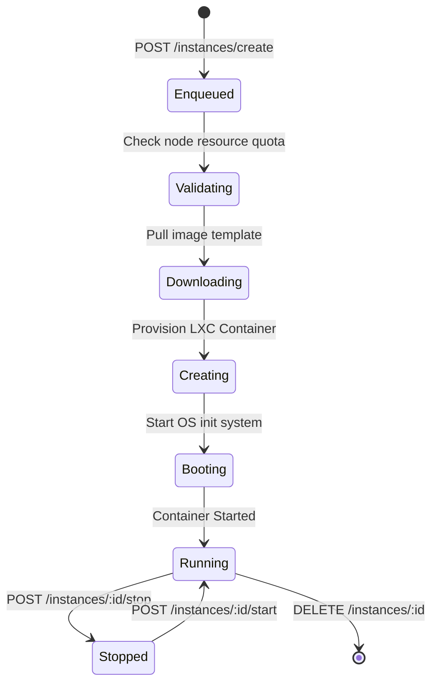

# CynexVM REST & WebSocket API Reference
Version: 1.0.0-production
Base URL: `https://your-panel-domain.com/api/v1`

Welcome to the CynexVM API documentation. This reference provides everything you need to programmatically deploy and orchestrate LXC containers on host nodes, manage user preferences, audit event logs, and handle real-time terminal and metrics streams over WebSockets.

---

## 1. Overview & Authentication

The CynexVM API is organized around REST. All requests must use HTTPS. Request and response bodies are formatted in JSON.

### Base URL
```
https://<your-panel-domain.com>/api/v1
```

### Authentication
All secure endpoints require authentication via JSON Web Token (JWT) Bearer tokens. 

Provide the token in the HTTP header:
```http
Authorization: Bearer <your_access_token>
```
Or via cookies if using a browser agent:
```http
Cookie: accessToken=<your_access_token>
```

For automation systems, you can use **Developer API Keys** passed in the headers:
```http
x-api-key: cv_live_<raw_secret_key>
```

### Error Response Format
All errors return standard HTTP status codes and a consistent JSON error payload:

```json
{
  "error": "A detailed explanation of the request rejection or system failure."
}
```

| Status Code | Description |
|---|---|
| `200 OK` | The request completed successfully. |
| `201 Created` | Resource was created successfully. |
| `400 Bad Request` | Invalid payload, validation error, or malformed parameters. |
| `401 Unauthorized` | Invalid or expired token or key. |
| `403 Forbidden` | Authenticated but lacks required role or permissions. |
| `404 Not Found` | The specified resource does not exist. |
| `429 Too Many Requests` | Rate limit exceeded. |
| `500 Internal Error` | An unexpected error occurred on the host node or panel database. |

---

## 2. Authentication Section

### POST `/auth/register`
Creates a new customer account.

* **Request Body:**
```json
{
  "username": "developer101",
  "email": "dev@cynexcloud.com",
  "password": "SecurePassword123!"
}
```
* **Response (201 Created):**
```json
{
  "message": "Registration successful. Please check your email to verify your account.",
  "userId": "9b1deb4d-3b7d-4bad-9bdd-2b0d7b3d4f8b"
}
```

---

### POST `/auth/login`
Authenticates user and returns access cookie.

* **Request Body:**
```json
{
  "identifier": "dev@cynexcloud.com",
  "password": "SecurePassword123!",
  "deviceId": "chrome-win-10"
}
```
* **Response (200 OK):**
```json
{
  "message": "Login successful.",
  "user": {
    "id": "9b1deb4d-3b7d-4bad-9bdd-2b0d7b3d4f8b",
    "username": "developer101",
    "email": "dev@cynexcloud.com",
    "twoFactorEnabled": false,
    "role": "User"
  }
}
```

---

### POST `/auth/logout`
Invalidates the current session token in the database and clears the browser cookie.

* **Headers:** Requires Authorization header.
* **Response (200 OK):**
```json
{
  "message": "Logged out successfully"
}
```

---

### POST `/auth/refresh`
Refreshes the current access token session lifecycle.

* **Request Body:**
```json
{
  "refreshToken": "session_refresh_token_jwt"
}
```
* **Response (200 OK):**
```json
{
  "accessToken": "new_signed_access_token_jwt",
  "refreshToken": "new_session_refresh_token_jwt"
}
```

---

### GET `/auth/me`
Retrieves details of the currently authenticated profile.

* **Response (200 OK):**
```json
{
  "user": {
    "id": "9b1deb4d-3b7d-4bad-9bdd-2b0d7b3d4f8b",
    "username": "developer101",
    "email": "dev@cynexcloud.com",
    "twoFactorEnabled": false,
    "role": "User",
    "permissions": ["instance.start", "instance.stop"]
  }
}
```

---

### POST `/auth/verify-email`
Verifies user registration using token.

* **Request Body:**
```json
{
  "token": "verify_token_uuid"
}
```
* **Response (200 OK):**
```json
{
  "message": "Email verified successfully."
}
```

---

### POST `/auth/resend-verification`
Resends the verification email.

* **Request Body:**
```json
{
  "email": "dev@cynexcloud.com"
}
```
* **Response (200 OK):**
```json
{
  "message": "Verification link has been resent."
}
```

---

## 3. User System

All user system calls require authorization.

### GET `/user/profile`
Fetches user details, including active database login sessions and developer tokens.

* **Response (200 OK):**
```json
{
  "profile": {
    "username": "developer101",
    "email": "dev@cynexcloud.com",
    "role": "User",
    "twoFactorEnabled": false
  }
}
```

---

### PATCH `/user/profile`
Updates username or email preferences.

* **Request Body:**
```json
{
  "username": "newdev101",
  "email": "newdev@cynexcloud.com"
}
```
* **Response (200 OK):**
```json
{
  "message": "Profile updated successfully.",
  "user": {
    "id": "9b1deb4d-3b7d-4bad-9bdd-2b0d7b3d4f8b",
    "username": "newdev101",
    "email": "newdev@cynexcloud.com"
  }
}
```

---

### GET `/user/activity`
Retrieves personal audit log entries.

* **Response (200 OK):**
```json
[
  {
    "id": "a1b2c3d4-e5f6-7a8b-9c0d-1e2f3a4b5c6d",
    "action": "instance.start",
    "ipAddress": "192.168.1.100",
    "details": "Started container cynex-110",
    "createdAt": "2026-06-30T10:45:11Z"
  }
]
```

---

### GET `/user/instances`
Returns a list of instances owned by the user.

* **Response (200 OK):**
```json
[
  {
    "id": "instance_uuid_101",
    "vmid": 110,
    "name": "Dev-Ubuntu-Server",
    "status": "running",
    "cpuCores": 2,
    "memoryMb": 2048,
    "storageGb": 20,
    "hostname": "cynex-110"
  }
]
```

---

## 4. VPS / Instance System (CORE SECTION)

The LXD daemon is the single source of truth. All virtual machine operations correspond to real container events on the hypervisor nodes.

### VPS Lifecycle Diagram


---

### POST `/instances/create`
Submits a container deployment task to the distributed job queue.

* **Request Body:**
```json
{
  "nodeId": "node_uuid_202",
  "name": "Production-API-Node",
  "hostname": "prod-api",
  "cpuCores": 4,
  "memoryMb": 4096,
  "storageGb": 50,
  "osTemplate": "ubuntu/22.04",
  "password": "InstanceAdminPassword1!"
}
```
* **Response (202 Accepted):**
```json
{
  "message": "VPS deployment enqueued.",
  "taskId": "K4LU1J2QF",
  "vmid": 112
}
```

---

### GET `/instances`
Queries local or clustered LXD nodes directly for active instance information.

* **Response (200 OK):**
```json
[
  {
    "id": "inst_112",
    "vmid": 112,
    "name": "Production-API-Node",
    "status": "running",
    "cpuCores": 4,
    "memoryMb": 4096,
    "storageGb": 50
  }
]
```

---

### GET `/instances/:id`
Fetches real-time status details of a specific container.

* **Response (200 OK):**
```json
{
  "id": "inst_112",
  "vmid": 112,
  "name": "Production-API-Node",
  "status": "running",
  "cpuCores": 4,
  "memoryMb": 4096,
  "storageGb": 50,
  "live": {
    "cpu": 0.12,
    "mem": 512409600,
    "maxmem": 4294967296,
    "disk": 2405900000,
    "maxdisk": 53687091200,
    "uptime": 128000
  }
}
```

---

### POST `/instances/:id/start`
Starts a stopped LXC container.

* **Response (200 OK):**
```json
{
  "message": "Container started successfully."
}
```

---

### POST `/instances/:id/stop`
Stops a running container.

* **Request Body:**
```json
{
  "force": false
}
```
* **Response (200 OK):**
```json
{
  "message": "Container stop signal sent successfully."
}
```

---

### POST `/instances/:id/restart`
Reboots the container.

* **Response (200 OK):**
```json
{
  "message": "Container reboot task accepted."
}
```

---

### DELETE `/instances/:id`
Permanently destroys the LXC container on the hypervisor and deallocates storage limits. 

* **Response (200 OK):**
```json
{
  "message": "Container deleted successfully."
}
```

---

### POST `/instances/:id/reinstall`
Wipes the root filesystem of the container and replaces it with a fresh image.

* **Request Body:**
```json
{
  "osTemplate": "debian/12",
  "password": "NewSecurePassword123!"
}
```
* **Response (202 Accepted):**
```json
{
  "message": "Reinstallation job enqueued.",
  "taskId": "RI5Z9B91J"
}
```

---

### GET `/instances/:id/metrics`
Fetches a snapshot of real-time network, memory, and CPU limits.

* **Response (200 OK):**
```json
{
  "cpuUsageNs": 412093810239,
  "memoryUsageBytes": 421098492,
  "diskUsageBytes": 1240984029,
  "network": {
    "eth0": {
      "bytesReceived": 102498234,
      "bytesSent": 5928192
    }
  }
}
```

---

## 5. Node / Infrastructure API

CynexVM is a clustered architecture. Nodes run `cynexd` (the Node Agent) to communicate with local LXD daemons.

### GET `/nodes`
Lists all active hypervisor nodes in the cluster.

* **Response (200 OK):**
```json
[
  {
    "id": "node_202",
    "name": "rosie-hypervisor",
    "apiUrl": "https://10.0.0.12:5005",
    "status": "online",
    "cores": 32,
    "memoryMb": 131072,
    "storageGb": 2048
  }
]
```

---

### POST `/nodes`
Registers a new hypervisor node in the cluster database.

* **Request Body:**
```json
{
  "name": "Node-3-West",
  "apiUrl": "https://10.0.0.13:5005",
  "apiToken": "cynexd_secret_handshake_hash"
}
```
* **Response (201 Created):**
```json
{
  "message": "Node registered successfully.",
  "nodeId": "node_303"
}
```

---

### DELETE `/nodes/:id`
De-registers a hypervisor node. Fails if there are still active containers deployed on it.

* **Response (200 OK):**
```json
{
  "message": "Node removed successfully."
}
```

---

## 6. Images / Templates

OS templates are pulled dynamically from simplestreams servers and cached on storage pools.

### GET `/images`
Lists cached OS images available on the active node.

* **Response (200 OK):**
```json
[
  {
    "fingerprint": "8c2bf80b2a...",
    "aliases": ["ubuntu/22.04/amd64"],
    "sizeBytes": 320948293,
    "description": "Ubuntu 22.04 LTS (Jammy Jellyfish)"
  }
]
```

---

### POST `/images/sync`
Instructs the hypervisor to download a remote OS image into the local cache.

* **Request Body:**
```json
{
  "osTemplate": "debian/12"
}
```
* **Response (202 Accepted):**
```json
{
  "message": "Image download sequence initiated."
}
```

---

## 7. Billing System

When billing is enabled, instances are bounded to plan limits.

### GET `/plans`
Lists available instance templates/plans.

* **Response (200 OK):**
```json
[
  {
    "id": "plan_starter",
    "name": "Starter VPS",
    "cores": 1,
    "memoryMb": 1024,
    "storageGb": 15,
    "priceMonthly": 5.00
  }
]
```

---

### POST `/payments/webhook`
Handles invoice events from third-party processors (e.g. Stripe) to suspend/unsuspend instances.

* **Request Body:**
```json
{
  "event": "invoice.payment_failed",
  "data": {
    "customerEmail": "dev@cynexcloud.com",
    "amountDue": 500
  }
}
```
* **Response (200 OK):**
```json
{
  "message": "Webhook processed. Suspended 1 instance."
}
```

---

## 8. Admin API

Administrators have access to global management parameters.

### GET `/admin/users`
Lists all registered users.

* **Response (200 OK):**
```json
[
  {
    "id": "usr_99",
    "username": "customer_a",
    "email": "customer@cynex.cloud",
    "role": "User"
  }
]
```

---

### POST `/admin/instances/:id/suspend`
Temporarily freezes container execution states (e.g. for non-payment).

* **Response (200 OK):**
```json
{
  "message": "Instance suspended successfully."
}
```

---

## 9. Queue & Deployment System

Every container build represents a sequence of steps handled by the asynchronous task runners.

### Job Failure & Rollback Protocol
If any task fails during deployment:
1. The engine logs the failure reason (e.g., `Insufficient storage capacity`).
2. An **automatic rollback** is executed to stop and delete the container on the host if it was partially provisioned.
3. The job status is flagged as `failed`.

### GET `/queue/jobs/:id`
Queries the status of a background task.

* **Response (200 OK):**
```json
{
  "id": "RI5Z9B91J",
  "status": "running",
  "progress": 60,
  "currentStage": "Creating",
  "currentStep": "Provisioning container config limits & mountpoints...",
  "logMessage": "Executing LXD REST create specifications..."
}
```

---

## 10. WebSockets

Real-time shell feeds and live metrics updates are streamed over WebSocket connections.

### Connection Handshake
To connect to the WebSocket gateway:
```
ws://<your-panel-domain.com>/socket.io/?EIO=4&transport=websocket
```

Attach to the instance using the `terminal.init` event after connecting. You must supply your JWT access token to authenticate the stream:

* **Send (terminal.init):**
```json
{
  "event": "terminal.init",
  "data": {
    "instanceId": "instance_uuid_101",
    "token": "your_access_token_jwt"
  }
}
```

* **Receive (terminal.log):**
```
Attaching to container cynex-110...
root@prod-api:~# 
```

### Keystrokes & Inputs
Send keystroke sequences to the shell using the `terminal.input` event:

* **Send (terminal.input):**
```json
{
  "event": "terminal.input",
  "data": "ls -la\n"
}
```
* **Receive (terminal.data):**
```
total 16
drwx------ 2 root root 4096 Jun 30 10:45 .
drwxr-xr-x 1 root root 4096 Jun 30 10:45 ..
-rw-r--r-- 1 root root 3106 Jun 30 10:45 .bashrc
-rw-r--r-- 1 root root  148 Jun 30 10:45 .profile
```

### Live Metrics Subscription
Subscribe to live CPU, Memory, Disk, and Network telemetry:

* **Send (metrics.subscribe):**
```json
{
  "event": "metrics.subscribe",
  "data": {
    "instanceId": "instance_uuid_101",
    "token": "your_access_token_jwt"
  }
}
```

* **Receive (metrics.data):**
Every 2 seconds, the client receives:
```json
{
  "cpu": 0.05,
  "maxcpu": 2,
  "mem": 412498234,
  "maxmem": 2147483648,
  "disk": 1240984920,
  "maxdisk": 21474836480,
  "netin": 12492,
  "netout": 9482,
  "uptime": 14209,
  "status": "running"
}
```
